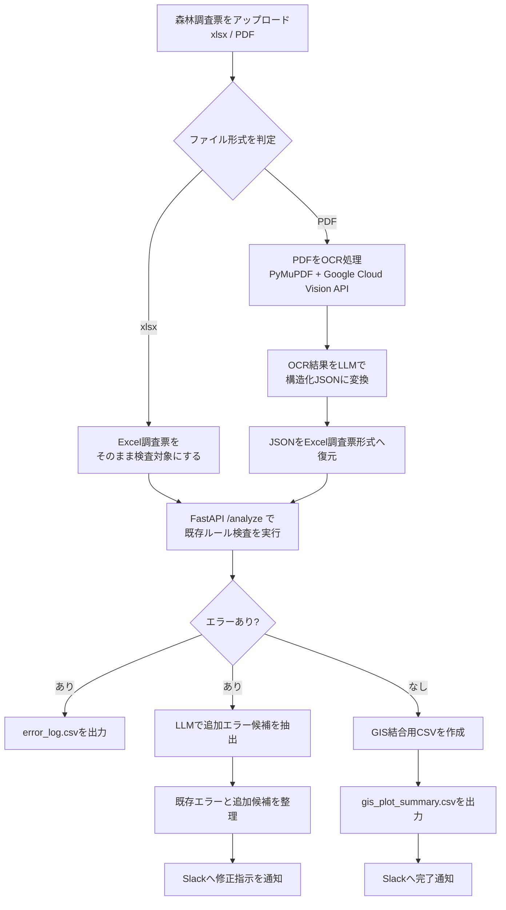
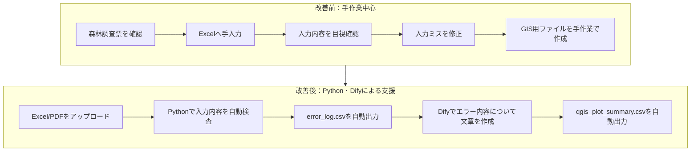
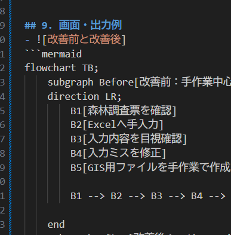

# プロジェクト名
森林調査結果データ入力・検査効率化ツール


## 1．プロジェクト概要
このツールは、森林調査で得られた測量結果の手入力と入力結果の検査、GIS用ファイルフォーマットへの変換の効率化を目的として制作したものです。


## 2．制作背景
測量業務では、現地調査後の測量データを指定のExcel様式へ手入力する作業があり、転記ミスや誤判読、入力後の確認作業に時間を要する点を課題として感じていました。
<br>
そこで、私が業務で経験した森林調査をテーマとして、生成AI・Python・Difyを活用し、架空の森林調査票を用いた測量データの入力支援と入力後の検査、GIS用ファイルフォーマット作成を行うツールを作成いたしました。
<br>
具体的には、Excel/PDFの調査票を入力ファイルとして、エラーチェック、OCR、GIS用CSV作成、Slack通知までの自動化に取り組み、業務改善を図りました。


## 3．解決したい課題
- 調査結果のExcel様式への入力作業の時間短縮、入力漏れ・数値の誤入力・転記ミスの減少
  - 調査結果は、紙の調査票へ記載した物のみ
  - 調査結果の紙資料も、PDFにスキャンして納品する
  - 紙資料は、記帳者の文字のくせ字・乱雑さ、資料そのものの汚れ、折れ曲がりあり

- 入力結果の検査、エラー修正の効率化
  - Excel様式で入力した物を、PC画面上もしくは印刷して確認している
  - PC画面上や印刷物による目視チェックは、チェック漏れ発生の可能性がある

- GIS用ファイルフォーマットへの変換の効率化
  - 座標値から、GISソフト上に展開する
  - Excel様式から、GIS用に別途編集が必要 


## 4. 主な機能
- PDFやExcelからの入力結果の取り込み
<br>
xlsx・PDF形式の森林調査票(調査結果を入力済み)から、入力結果を取り込む機能

- OCR機能
<br>
PDFの場合には、AI OCR機能を用いて処理を実行する機能

- PDF → Excel形式への出力
<br>
AI OCR機能を用いて抽出した文字・数字を、特定のExcel形式で出力するための機能

- 入力内容のチェック
<br>
既存エラールールが記載されたcsvファイルと、森林調査票の調査項目のセル位置を記載したxlsxから入力内容を検査する機能

- エラーログの出力
<br>
入力内容のチェックの結果、エラーがあった場合にはcsv形式のエラーログを出力する機能

- 追加エラー候補のチェック
<br>
既存エラールールにない新規のエラーの可能性を検査し、追加エラー候補として出力する機能

- GIS用サマリーCSVへの変換・出力
<br>
入力結果の集計を行いGISソフト(ArcGISPro、QGISを想定)上で表示可能なサマリーCSVへ変換・出力を行う機能

- Slackへの通知
<br>
エラーの有無と、エラー内容と修正指示、追加エラー候補についてSlackへを投稿する機能


## 5. 使用技術・目的
| 技術 | 使用場面 | 理由 |
| :--- | :--- |  :---  |
| Python 3.13.13 | xlsxファイルの読み取り、入力結果のチェック、<br>エラーログ、GIS用サマリーCSVへの変換・出力 | 複雑なコード処理実行のため、<br>標準ライブラリ外(openpyxl、google-cloud-vision、pymupdf、fastAPI)を使用するため |
| ChatGPT | 制作物のアイデア出し、コード開発・解説、<br>エラー内容の原因特定、コード評価・改善案作成、<br>API使用、README文章作成 | コード開発の効率化、ClaudeCode開発のコード評価・解説・改善案作成のため |
| ClaudeCode | コード開発・解説、エラー内容の原因特定、<br>コード内容のテスト実行、FastAPI設定方法解説 | コード開発の効率化、テスト実施のため |
| Dify(Webクラウド版) | 入力結果のチェック～csv出力までの一連の処理実行 | 一連の処理実施のため |
| openpyxl | 森林調査票のセル位置取得 | 調査項目のセル位置を取得するため |
| google-cloud-vision(AI OCR) | PDFからの文字・数字抽出 | 調査結果の手入力作業を減少させるため |
| pymupdf | AI OCR実行後の更なる文字・数字抽出 | AI OCRのみでは、抽出精度が低かったため<br>PDFライブラリの中で、表形式に対応していたため選択 |
| FastAPI | DifyにおけるPythonコード実行 | Difyから、Pythonコードを実行するため |
| OpenAI API | LLMによる追加エラー候補抽出、Slack投稿文作成 | 既存エラールールになるエラーの抽出、<br>入力結果の修正指示の効率化のため |
| Visual Studio Code | コード開発、GitHubへのadd → commmit → push | コード開発、GitHub管理のため |
| GitHub | ツールアップロード、README公開 | 制作物公開のため |
| Render | FastAPI外部公開 | DifyでのFastAPI実行のため(GitHubとの連携が容易であるため選択) |
| Slack | エラー内容と修正指示、追加エラー候補の内容、エラーなしについての文章を投稿する | エラー修正の効率化のため |
| QGIS 3.44.0 | GIS用サマリーCSVの結果確認 | 出力結果の位置確認のため |


## 6. フォルダ構成
このツールにおけるフォルダは、以下の構成となっております。
```text
forest_survey_check_tool/
├── README.md  # プロジェクト説明
├── requirements.txt  # ライブラリ一覧   
├── .gitignore  # GitHubに含めないファイル設定
│ 
├── api/
│   └── main.py  # FastAPIのメイン処理
│ 
├── dify/
│   └── 森林調査データ入力・検査効率化ツール.yml  # Difyのymlファイル
│ 
├── docs/
│   └── images/  # README用画像
│  
├── gis/
│   ├── README_QGIS.md
│   ├── forest_survey_check.qgz
│   └── data/
│       ├── gis_plot_summary.csv  # QGIS表示用CSV
│       └── qgis_plot_summary.gpkg  # QGIS表示用GeoPackage
│ 
├── master/
│   ├── template_forest_survey.xlsx          # 森林調査票の原本
│   ├── check_rules_forest_survey.csv        # 検査ルール定義
│   └── forest_survey_cell_mapping.xlsx      # 森林調査票の調査項目のセル位置対応表
│
└── samples/
    ├── input/
    │   ├── sample_forest_survey_3plots_errorあり.PDF  # 入力用サンプルPDF(入力ミスあり)
    │   ├── sample_forest_survey_3plots_errorなし.PDF # 入力用サンプルPDF(入力ミスなし)
    │   ├── sample_forest_survey_3plots_errorあり.xlsx  # 入力用サンプルExcel(入力ミスあり) 
    │   └── sample_forest_survey_3plots_errorなし.xlsx  # 入力用サンプルExcel(入力ミスなし)
    │ 
    └── output/
        ├── error_log_pdfから出力.csv  # エラーログ(入力ファイルがPDF)
        ├── error_log_xlsxから出力.csv  # エラーログ(入力ファイルがxlsx)
        ├── gis_plot_summary.csv  # GIS表示用ファイル
        └── ocr_log.csv  # AI OCR＋pymupdfからの読み取り結果           

```


## 7. 処理のワークフロー
このツールは、森林調査票の入力後に発生する確認作業・GIS用データ作成を効率化するためのワークフローです。
Difyで入力ファイルの受付と処理分岐を行い、Python/FastAPIで森林調査票の検査・CSV出力・PDF OCR処理を実行します。
また、LLMを用いて既存ルールでは判定しきれない追加エラー候補を抽出いたします。
最後に、エラー内容についてSlackへ確認内容を通知します。



## 処理の概要
| 処理段階 | 内容 | 主な使用技術 |
| :--- | :--- |  :---  |
| 1. 入力 | 森林調査票のxlsxまたはPDFをアップロード | Dify |
| 2. ファイル形式判定 | xlsxとPDFで処理を分岐 | Dify |
| 3.PDF OCR | PDFを画像化し、OCRで文字を抽出 | PyMuPDF / Google Cloud Vision API |
| 4. 構造化 | OCR結果をLLMでJSON形式に整理 | Dify / LLM |
| 5. Excel復元 | JSONを森林調査票のExcel形式へ変換 | Python / openpyxl / FastAPI |
| 6. 既存ルール検査 | 基本情報・毎木調査欄の入力ミスを検査 | Python / openpyxl |
| 7. エラー時処理 | エラーログCSVを出力し、修正指示をSlack通知 | CSV / Slack |
| 8. 正常時処理 | GIS結合用CSVを出力 | Python / CSV / GIS |
| 9. 追加確認 | LLMで追加エラー候補を抽出 | Dify / LLM |

## このワークフローで効率化した作業
- 森林調査票の入力内容のチェック

- 未入力・数値異常・樹高と枝下高の矛盾などの確認

- エラー内容の一覧化

- GISで利用するためのCSV作成

- 修正指示や確認事項のSlack通知

- PDF調査票からのOCR抽出とExcel形式への復元

## 8．実行方法
1．DSLファイルのインポート
<br>
Difyのスタジオから「アプリを作成する」→ 「DSLファイルのインポート」で、「森林調査データ入力・検査効率化ツール.yml」をインポートします。
<br>
2．FastAPIのURL設定
<br>
Render_API_BASE_URL には、デプロイ済みFastAPIのURLを設定してください。例：https://your-render-app.onrender.com
<br>
3. ファイルのアップロード
<br>
最初のノードである「開始(現地調査結果入力)」→ 「ローカルアップロード」からxlsxもしくはPDF形式の森林調査票をアップロードします。
<br>
4. 処理開始
<br>
「実行開始」を行うと、ワークフローに応じた処理が実行されます。
<br>
5．ファイル・Slack投稿文の出力
処理が終了すると、csv形式のエラーログ、GIS用ファイルが出力されるので、ファイル名を付けて任意のフォルダに保存いたします。


## 9. 画面・出力例
- 改善前、改善後の処理フローの比較

- ![Dify:森林調査票アップロード]
(docs/images/dify_workflow.png)
- 


## 10．工夫した点
### 10-1. 森林調査票
- 本ツールで使用する森林調査票のExcel様式の入力項目や選択肢は、森林調査業務で使用される項目を想定して作成いたしました。

- 調査項目の中で、斜面位置、斜面方位、異常区分、被害区分の選択肢については、参考文献を元に、実際の森林調査の多くで適用されると思われる選択肢を設定いたしました。
<br>
ただし、この制作物で使用しているExcel様式は、卒業制作物のテスト用に私の方で作成したサンプル様式であり実際の森林調査票とは異なっております。

### 10-2. APIの設定
- FastAPIを用いてRenderでデプロイすることで、エラーチェック、ファイル出力を実行するように設定いたしました。

- Google Cloud Vision APIの認証JSONは、秘密情報のためGitHubには含めず、ローカル環境では環境変数 GOOGLE_APPLICATION_CREDENTIALS で管理しました。
<br>
Render環境ではSecret Fileとして登録し、同じ環境変数名から参照する構成にいたしました。

### 10-3．その他
- 既存エラールールにない新規のエラー候補の抽出を、LLMを用いて行うシステムを実装いたしました。 

- Slack通知機能は、エラーチェック後の結果共有を想定して実装しました。
<br>
ただし、Webhook URLはシークレット情報であるため、DifyのSecret型環境変数として管理し、GitHubには公開しておりません。


## 11. 生成AIに支援してもらった部分・自分で担当した部分
### 11-1．生成AIに支援してもらった部分
- Pythonのコード開発、テスト実施、エラー内容の原因特定、コード改善案作成

- FastAPI外部公開方法

- Difyワークフローノード内容作成

- README構成案

### 11-2．自分で担当した部分
- 課題の設定

- 森林調査票のExcel様式の作成

- PDFモジュールの選択

- LMMプロンプトの修正

### 11-3．自分で確認した部分
- 開発されたコードの意味確認

- FastAPIでの動作確認

- DifyとのHTTP連携確認

- LLMのプロンプト内容確認

- 出力CSVの内容確認


## 12．テスト結果


## 13. 現時点の課題・制約
- Pythonコードであるmain.pyの分割化

- 既存エラー内容の条件式の定数化

- LLMで抽出した追加エラー候補をファイル出力するコードの追加

- 既存のエラールールで「エラーなし」と判断された場合の、追加エラー候補抽出

- PDFからの文字、数字抽出精度の向上


## 14. 今後の改善点・取り入れたい技術
- AWS等のクラウドサーバーを用いたFastAPIの実施

- OpenCV等を用いたOCR抽出精度の向上

- RAGを用いたLLMによる追加エラー候補抽出の精度向上

- Shapefile、Geojsonへのファイルフォーマットへの変換


## 15. 参考文献
- 林野庁森林生態系多様性基礎調査 調査方法の概要（参考）
