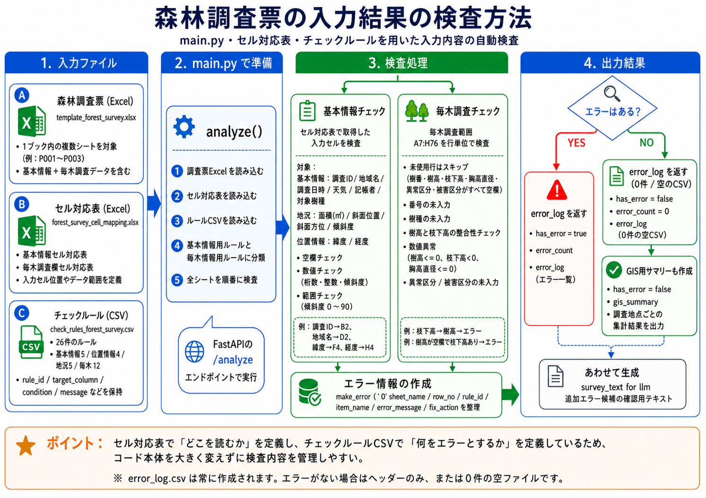
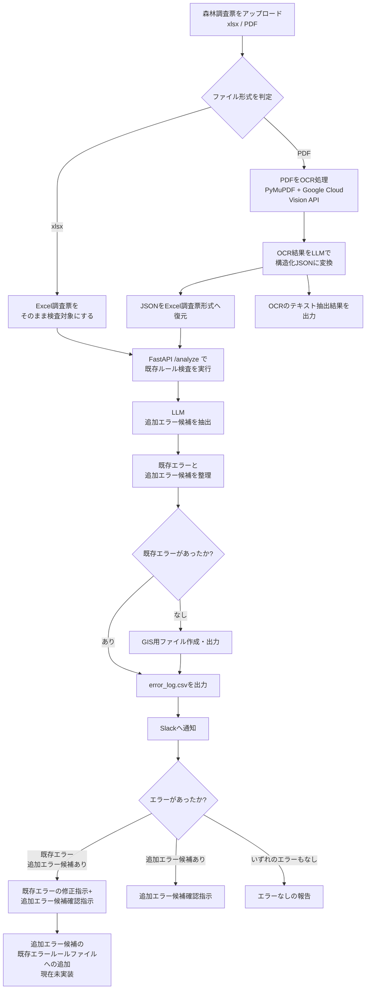
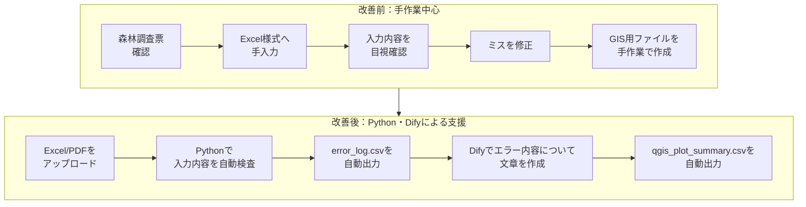
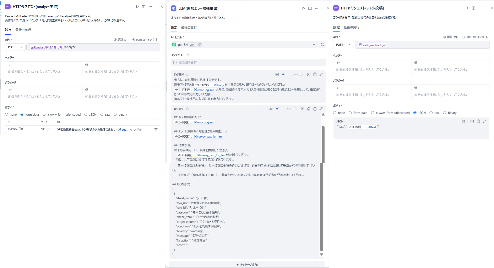
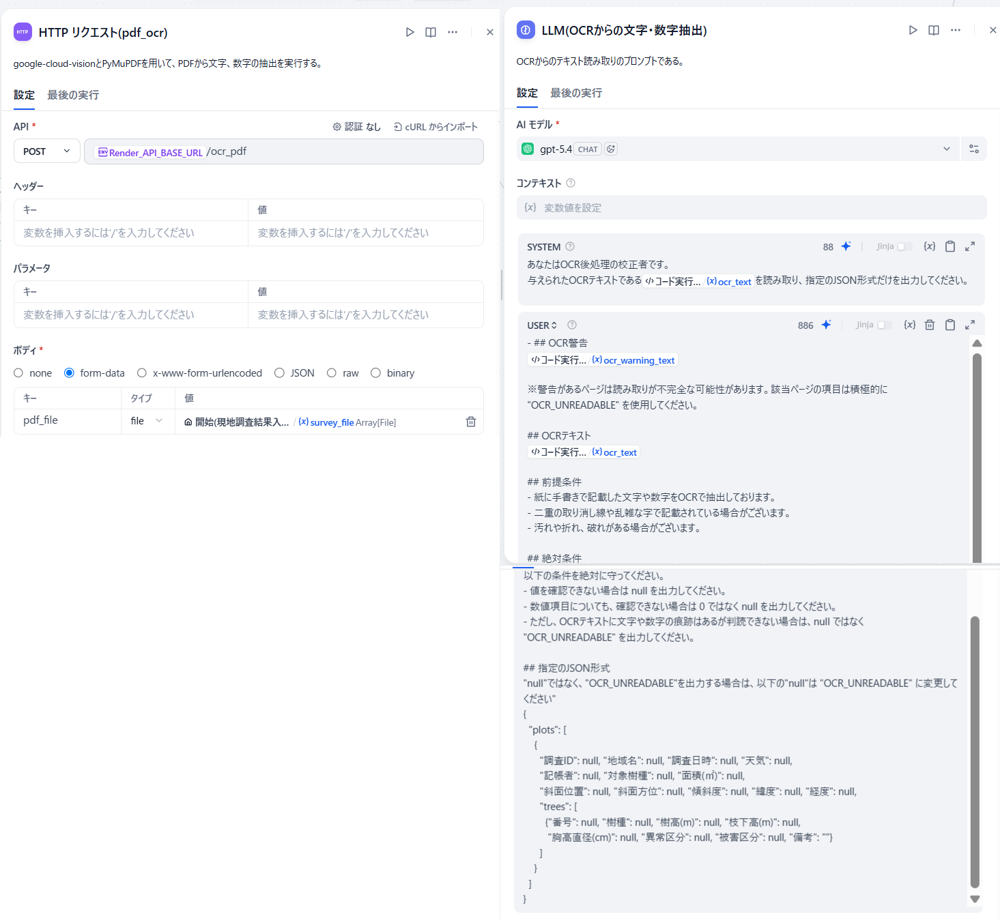
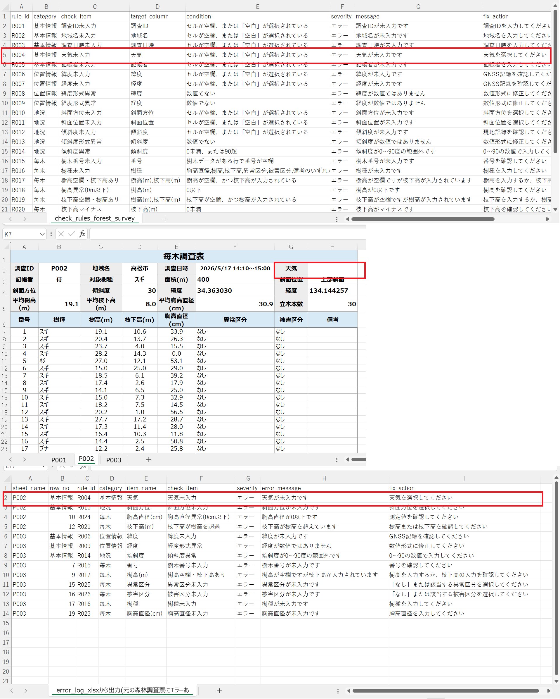
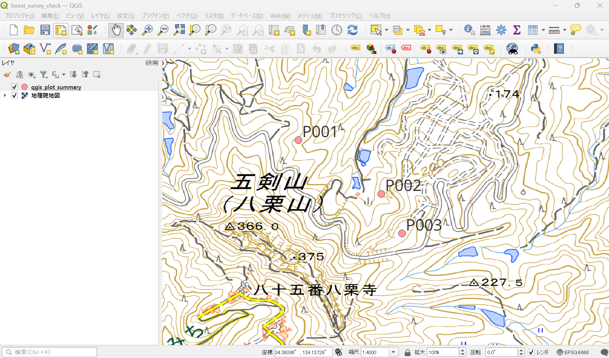
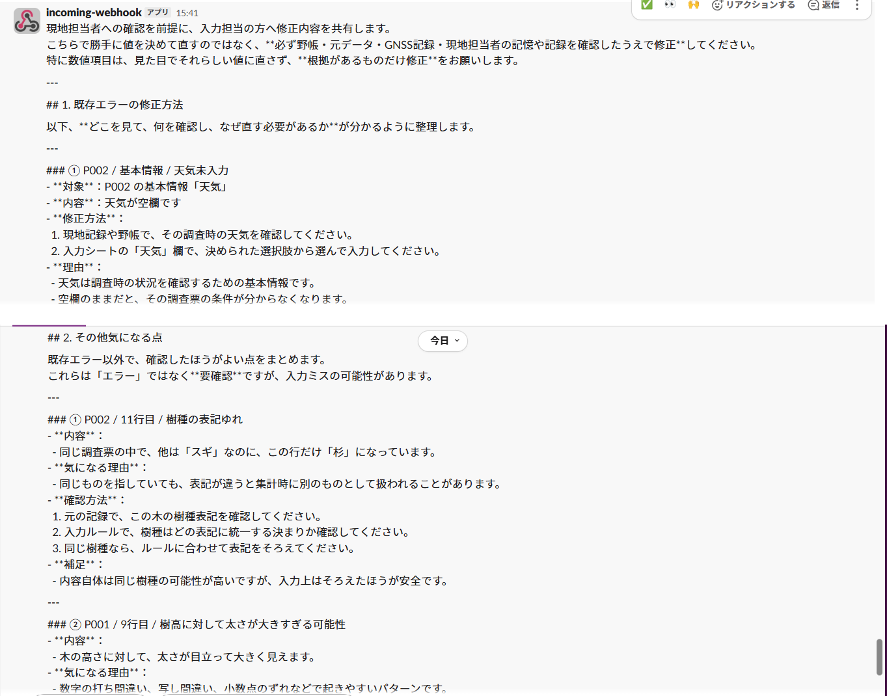

# プロジェクト名

森林調査データ入力・検査効率化ツール

---

## 1．プロジェクト概要

このツールは、森林調査で得られた現地調査結果の手入力による整理と入力結果の検査、GIS用ファイルの作成の効率化を目的として制作したものです。

---

## 2．制作背景

測量業務では、調査後の測量データを指定のExcel様式へ手入力する作業があり、転記ミスや誤判読の発生や入力後の検査に時間を要する点を課題として感じていました。<br>
そこで、私が業務で経験した森林調査をテーマとして、ITスクールで学習した生成AI・Python・Difyを活用し、架空の森林調査票を用いた測量調査データの入力支援と入力後の検査、GIS用ファイルへの変換・作成を行うツールを制作し、業務改善を図りました。

---

## 3．解決したい課題

- 調査結果のExcel様式への入力作業の時間短縮、入力漏れ・文字や数値の誤入力・転記ミスの減少
  - 調査結果は、現地において紙の調査票へ記載したものが中心です。
  - 紙資料は、記帳者の文字のくせ字・乱雑さ、資料そのものの汚れや折れ曲がりがあり文字や数値の誤入力が発生しやすいです。

- 入力結果の検査、エラー修正の精度向上と時間短縮
  - Excel様式で入力した調査結果を、PC画面上もしくは印刷して確認しております。
  - PC画面上や印刷物による目視や読み合わせによる確認は、時間を要しかつチェック漏れ発生の可能性がございます。

- GIS用ファイルの作成の効率化
  - 座標値から、GISソフト上に展開して位置確認を行っております。
  - Excel様式から、GIS用ファイルへ変換するのに別途編集作業が必要であり、煩雑でかつ時間を要しております。

---

## 4．主な機能

このツールで実装した主な機能を、表4-1に示します。

<p align="center">
  <strong>表4-1　主な機能の一覧表</strong>
</p>
<br>

<div align="center">

| 機能 | 内容|
| :--- | :--- |
| 入力結果の取り込み | xlsx・PDF形式の森林調査票(調査結果を入力済み)から、入力結果を取り込む。 |
| OCR | PDFの場合には、AI OCR機能を用いて処理を実行する。 |
| PDF → Excel形式への復元 | AI OCR機能を用いて抽出したテキストを特定のExcel形式に復元する。 |
| 入力内容のチェック | 既存エラールール(以下既存エラー)が記載されたcsvファイルと、森林調査票の調査項目のセル位置を記載したxlsxから入力内容を検査する。 |
| エラーログの出力 | 入力内容の検査の結果、エラーがあった場合にはcsv形式のエラーログを出力する。 |
| 追加エラー候補のチェック | 既存エラーにない新規のエラーの可能性を検査し、追加エラー候補として抽出する。 |
| GIS用ファイルへの<br>変換・出力 | 入力結果の検査の結果、既存エラーがない場合には調査地点ごとで集計を行い、GISソフト上で表示可能なファイルのフォーマット形式へ変換・出力を行う。 |
| Slackへの通知 | LLMに、エラーの有無と、既存エラー内容と修正指示、追加エラー候補の確認内容についての文章を作成させ、Slackへ投稿する。 |

---

</div>

## 5．使用技術・目的

主な機能を実装するために使用した技術と使用した場面、その技術を使用した目的の一覧を表5-1に示します。

<p align="center">
  <strong>表5-1　使用技術と使用場面、使用目的の一覧表</strong>
</p>
<br>

<div align="center">

| 技術 | 使用場面 | 目的 |
| :--- | :--- |  :---  |
| Python 3.13.13 | - xlsxファイルの読み取り<br>- 入力結果のチェック<br>・エラーログ出力<br>・GIS用ファイルへの変換・出力 | ・複雑なコード処理実行<br>・DifyのPythonコードライブラリにないopenpyxl、<br>　google-cloud-vision、PyMuPDF、FastAPIの使用 |
| ChatGPT | ・制作物のアイデア出し<br>・コード開発・解説、エラー内容の原因特定<br>・コード評価・改善案作成<br>・OpenAI API使用<br>・README文章作成支援 | ・コード開発の効率化<br>・ClaudeCode開発のコード評価・解説、<br>　改善案作成 |
| ClaudeCode | ・コード開発・解説、エラー内容の原因特定、<br>　コード内容のテスト実行<br>・FastAPI設定方法解説 | ・コード開発の効率化、テスト実施 |
| Dify(Webクラウド版) | ・ファイルのアップロード～ファイル出力までの<br>　一連の処理実行 | ・調査票から、GIS用ファイルフォーマットへの<br>　変換・出力の効率化 |
| openpyxl | 森林調査票のセル位置取得 | ・森林調査票における調査項目のセル位置の取得 |
| google-cloud-vision | PDFからの文字・数字抽出 | ・PDFからExcel様式への出力<br>・調査結果の手入力作業を減少させる |
| PyMuPDF | AI OCR実行後の更なる文字・数字抽出 | ・AI OCRのみでは、抽出精度が低かった<br>・PDFライブラリの中で、表形式に対応していた |
| FastAPI | DifyにおけるPythonコード実行 | ・Difyから、Pythonコードを実行する<br>・複雑なPythonコード処理実行 |
| OpenAI API | ・LLMによる追加エラー候補抽出<br>・Slack投稿文作成 | ・追加エラー候補の抽出<br>・エラーの有無、エラー内容の投稿文作成 |
| Visual Studio Code | ・コード開発実施<br>・GitHubへのadd → commmit → push | ・コード開発作業<br>・GitHub管理 |
| GitHub | ・ツールアップロード<br>・README公開 | ・ツール外部公開 |
| Render | ・FastAPI外部公開 | ・DifyでのFastAPI実行<br>・GitHubとの連携が容易である |
| Slack | ・Difyからのエラーの有無、既存エラー内容と<br>　修正指示、追加エラー候補の確認 | ・エラー修正、確認の効率化 |
| QGIS 3.44.0 | ・GIS用に出力したファイルの確認 | ・GIS用ファイルへの出力結果の確認 |

---

</div>

## 6．フォルダ構成

GitHubにアップロードしたフォルダにおける構成は、図6-1に示した内容となっております。

```
forest_survey_check_tool/
├── README.md  # プロジェクト説明
├── requirements.txt  # ライブラリ一覧   
├── .gitignore  # GitHubに含めないファイル設定
│ 
├── api/
│   └── main.py  # FastAPIのメイン処理
│ 
├── dify/
│   └── 森林調査データ入力・検査効率化ツール.yml  # Difyのymlファイル
│ 
├── docs/
│   ├── deploy_render.md  # Renderを用いたデプロイの方法をまとめた資料
│   └── images/  # README用画像
│  
├── gis/
│   ├── forest_survey_check.qgz  # QGIS表示確認用プロジェクトファイル
│   └── data/
│       ├── gis_plot_summary.csv  # QGIS表示用CSV
│       └── qgis_plot_summary.gpkg  # QGIS表示用GeoPackage(QGISで確認しやすいように、GeoPackage形式のサンプルデータも格納しております。)
│ 
├── master/
│   ├── template_forest_survey.xlsx  # 森林調査票の原本
│   ├── check_rules_forest_survey.csv  # 既存のエラールールを定義したファイル
│   └── forest_survey_cell_mapping.xlsx  # 森林調査票の調査項目のセル位置対応表
│
└── samples/
    ├── input/
    │   ├── sample_forest_survey_3plots_errorあり.PDF  # 入力用サンプルPDF(入力ミスあり)
    │   ├── sample_forest_survey_3plots_errorなし.PDF # 入力用サンプルPDF(入力ミスなし)
    │   ├── sample_forest_survey_3plots_errorあり.xlsx  # 入力用サンプルExcel(入力ミスあり) 
    │   └── sample_forest_survey_3plots_errorなし.xlsx  # 入力用サンプルExcel(入力ミスなし)
    │ 
    └── output/
        ├── error_log_PDFから出力(元の森林調査票にエラーあり).csv  # エラーログ(入力ファイルがPDF)
        ├── error_log_PDFから出力(元の森林調査票にエラーなし).csv  # エラーログ(入力ファイルがPDF)
        ├── error_log_xlsxから出力(元の森林調査票にエラーあり).csv  # エラーログ(入力ファイルがxlsx)
        ├── error_log_xlsxから出力(元の森林調査票にエラーあり).csv  # エラーログ(入力ファイルがxlsx)
        ├── gis_plot_summary.csv  # GIS表示用ファイル  # GIS表示用ファイル
        ├── ocr_抽出結果(元の森林調査票にエラーあり).csv  # PDFの文字・数字抽出結果(元の森林調査票にエラーあり)
        └── ocr_抽出結果(元の森林調査票にエラーなし).csv  # PDFの文字・数字抽出結果(元の森林調査票にエラーなし)           

```

<p align="center">
  <strong>図6-1　フォルダ構成</strong>
</p>
<br>

---

## 7．処理内容

### 7-1．処理内容の概要

まずはDifyで入力ファイルの受付と処理分岐を行い、次にFastAPIを用いたPythonコード処理を実施し、PDFへのOCR処理、森林調査票の入力内容の検査、エラー抽出、GIS用ファイル作成を実行します。<br>
また、LLMを用いて既存ルールでは判定しきれない追加エラー候補を抽出いたします。
最後に、エラー内容についてSlackへ確認内容を通知します。

---

### 7-2．各処理段階の概要

本ツールの、処理段階とその内容、使用した技術の概要を表7-2-1に示します。

<p align="center">
  <strong>表7-2-1　各処理段階の概要</strong>
</p>
<br>

<div align="center">

| 処理段階 | 内容 | 主な使用技術 |
| :--- | :--- |  :---  |
| 1. 入力 | 森林調査票のxlsxまたはPDFをアップロード | Dify |
| 2. ファイル形式判定 | xlsxとPDFで処理を分岐 | Dify |
| 3. PDF OCR | PDFを画像化し、OCRで文字を抽出 | PyMuPDF / Google Cloud Vision API |
| 4. 構造化 | OCR結果をLLMでJSON形式に整理 | Dify / LLM |
| 5. Excel様式変換 | JSONを森林調査票のExcel形式へ変換 | Python / openpyxl / FastAPI |
| 6. 検査 | 調査項目ごとに入力結果を検査 | Python / openpyxl |
| 7. エラー時処理 | エラーログCSVを出力し、修正指示をSlack通知 | CSV / Slack |
| 8. 正常時処理 | GIS用ファイルを出力 | Python / CSV / GIS |
| 9. 追加確認 | LLMで追加エラー候補を抽出 | Dify / LLM |

---

</div>

### 7-3．処理方法

#### 7-3-1．入力結果の検査方法

Pythonを用いた入力結果の検査方法を、図7-3-1-1に示します。<br>まず、森林調査票に対して林調査票の調査項目のセル位置対応表を用いて各調査項目の入力セル位置やデータ範囲を特定します。<br>
その後は、既存のエラールールを定義したファイルから調査項目ごとのルールを取り出し、各調査項目ごとに検査を行っていきます。<br>
最後に、エラーの有無に応じてエラーログ、毎木情報を集計してGIS用ファイルを作成し出力いたします。

<p align="center">
  
</p>

<p align="center">
  <strong>図7-3-1-1　森林調査票の入力結果の検査方法(画像生成：ChatGPT)</strong>
</p>

---

#### 7-3-2．Difyによる一括処理

本ツールの、Difyにおける処理のワークフローを図7-3-2-1に示します。<br>Dify上で、xlsxもしくはPDF形式の入力結果をアップロードすることで、入力結果の検査～ファイル作成までの処理を一括で行えるワークフローを実装いたしました。

<div align="center">


</div>

<p align="center">
  <strong>図7-3-2-1　Difyにおける処理のワークフロー</strong>
</p>
<br>

---

## 8．実行方法

このツールを実行するための手順を以下に示します。

---

### 8-1．ローカルでの実行方法

以下のコマンドは、OSはWindows、ターミナルはPowerShellで実行することを想定しております。

```
1. リポジトリをクローン
git clone https://github.com/ユーザー名/リポジトリ名.git

2. 仮想環境を作成・有効化
python -m venv .venv
.\.venv\Scripts\Activate.ps1

3. ライブラリをインストール
python -m pip install -r requirements.txt

4. FastAPIを起動
python -m uvicorn api.main:app --reload

5. `/docs` でAPIを確認
以下のURLにアクセスし、動作を確認する。
http://127.0.0.1:8000
http://127.0.0.1:8000/docs

```

---

### 8-2．Renderにおけるデプロイ設定

本ツールは、Renderにデプロイし、DifyのHTTPリクエストノードからFastAPIのエンドポイントを呼び出して処理を実行する構成としました。<br>Render 上では、以下のような設定で起動しております(詳細な手順は、deploy_render.mdに整理しております)。

| 項目 | 設定 |
|---|---|
| Runtime | Python |
| Build Command | `pip install -r requirements.txt` |
| Start Command | `uvicorn main:app --host 0.0.0.0 --port $PORT` |
| 使用用途 | Dify から API を呼び出すため |

---

### 8-3．Difyとの連携

以下の手順で、Difyでワークフローを実行してください。

``` 
1．DSLファイルのインポート
Difyのスタジオから「アプリを作成する」→ 「DSLファイルのインポート」で、「森林調査データ入力・検査効率化ツール.yml」をインポートします。

2．FastAPIのURL設定
Render_API_BASE_URL には、デプロイ済みFastAPIのURLを設定してください。
例：https://your-render-app.onrender.com

3．ファイルのアップロード
最初のノードである「開始(現地調査結果入力)」→ 「ローカルアップロード」からxlsxもしくはPDF形式の森林調査票をアップロードします。

4．処理開始
「実行開始」を行うと、ワークフローに応じた処理が実行されます。

5．ファイル・Slack投稿文の出力
処理が終了すると、csv形式のエラーログ、GIS用ファイルが出力されるので、ファイル名を付けて任意のフォルダに保存いたします。

```

---

## 9．画面・出力例

### 9-1． 想定される処理フローの変化

本ツールを導入することで想定される処理フローの改善前、改善後を比較したものを図9-1-1に示します。<br>一部の作業の自動化を実施することで、手作業とミスを減少させ、全体の作業時間の減少につながることが考えられます。


<p align="center">
  <strong>図9-1-1　改善前、改善後の処理フローの比較</strong>
</p>
<br>

---

### 9-2．Difyの主要ノード

Difyの主要ノードを、図9-2-1に示します。<br>このワークフローの中で、入力結果の検査を行うHTTPリクエスト(analyze実行)ノード、追加エラー候補の抽出を行うLLM(追加エラー候補抽出)ノード、Slack投稿を行うHTTPリクエスト(Slack投稿)ノードを示しております。<br>

- HTTPリクエスト(analyze実行)ノード<br>
main.pyのanalyzeのエンドポイント実行により、既存エラーのルールが記載されたファイルを元に検査を行います。

- LLM(追加エラー候補抽出)ノード<br>
既存エラー以外にも、LLMに既存エラー以外にもエラーと思われるものがないか検査させ、追加エラー候補として抽出させます。

- HTTPリクエスト(Slack投稿)ノード<br>
エラー内容についてLLMが作成した文章をSlackに投稿いたします。

<p align="center">
  
</p>

<p align="center">
  <strong>図9-2-1　Difyの主要ノード</strong>
</p>

---

### 9-3．PDF OCRのノード

PDFからのテキスト抽出のノードについて図9-3-1に示します。<br>HTTPリクエストでは、PyMuPDFとGoogle Cloud Vision APIを組み合わせて文字・数字の抽出を行うpdf_ocrのエンドポイントを呼び出して処理を実行しております。<br><br>
また、更にLLMノードでは、ocr_pdfによるテキスト抽出後に、JSON形式で受け取ったテキストから更にテキスト抽出を行い、抽出精度向上に取り組みました。

<p align="center">
  
</p>

<p align="center">
  <strong>図9-3-1　PDFからのテキスト抽出のノード</strong>
</p>

---

### 9-4．エラーログ

出力されたエラーログを、図9-4-1に示します。<br>既存エラーファイル(図上段)と検査を行った森林調査票(図中段)、エラーログ(図下段)を比較すると、例えば「天気」の調査項目でエラーが抽出されていることがわかります。

<p align="center">
  
</p>

<p align="center">
  <strong>図9-4-1　エラーログ</strong>
</p>

---

### 9-5．GIS用ファイル

作成されたGIS用ファイルをQGIS上に展開したものを、図9-5-1に示します。<br>背景図には、## 15. 参考文献・使用データにあるように、地理院タイルを引用しております。<br>
GISに展開できるGIS用ファイルとなっていることがわかります。

<p align="center">
  
</p>

<p align="center">
  <strong>図9-5-1　GIS上におけるファイル展開</strong>
</p>

---

### 9-6．PDFからのテキスト抽出結果

PDFから抽出した結果と、PDFファイルにおけるエラーログを図9-6-1に示します。<br>PDFは、Excel様式の森林調査票を一度印刷し、再度PDFでスキャンしたものです(図上段)。<br>
また、抽出した結果もログとして確認用に出力できるようになっております(図中段)。<br>
PDFからの抽出の場合も同様に、エラーログを抽出できております(図下段)。

<p align="center">
  
</p>

<p align="center">
  <strong>図9-6-1　PDFから抽出した結果とPDFファイルにおけるエラーログ</strong>
</p>

---

### 9-7．Slack投稿文

Difyから送付されたSlack投稿文(既存エラー・追加エラー候補あり)の結果を、図9-7-1に示します。<br>それぞれ担当者に確認することを前提にしつつも、修正方法や修正が必要な理由が記載されております。<br>
また、追加エラー候補の内容を確認すると、樹高に対して胸高直径(木の太さ)が大きいという内容を指摘しており、LLMの方でエラー候補を判断して指摘していることがわかります。

<p align="center">
  
</p>

<p align="center">
  <strong>図9-7-1　Slack投稿文</strong>
</p>


---

## 10．工夫した点

### 10-1. 森林調査票

- 本ツールで使用する森林調査票のExcel様式の入力項目や選択肢は、森林調査業務で使用される項目を想定して作成いたしました。

- 調査項目の中で、斜面位置、斜面方位、異常区分、被害区分の選択肢については、参考文献を元に、実際の森林調査の多くで適用されると思われる選択肢を設定いたしました。<br>ただし、この制作物で使用しているExcel様式は、卒業制作物のテスト用に私の方で作成したサンプル様式であり実際の森林調査票とは異なっております。

---

### 10-2. 入力ファイルの形式

- 本ツールでは、森林調査票のファイル形式をxlsxとPDFといたしました。

- 理由は、調査結果をxlsxへ入力する場合が多かったこと、紙の調査結果もPDFで客先に納品を求められていたことがございます。<br>
PDFから調査結果を直接Excel様式へ精度良く変換・出力することが可能になれば、手入力作業・確認の時間を大幅に短縮できると考え、入力ファイルにPDFも対応するように設計いたしました。

---

### 10-3．セキュリティの設定

- Google Cloud Vision APIの認証JSONは、秘密情報のためGitHubには含めずローカル環境では環境変数 GOOGLE_APPLICATION_CREDENTIALS で管理しております。

- Render環境ではSecret Fileとして登録し、同じ環境変数名から参照する構成にいたしました。

- Slackへの投稿では、Webhook URLはシークレット情報であるためDifyのSecret型環境変数として管理し、GitHubには公開しておりません。

---

### 10-4. その他の設定

- FastAPIを用いてRenderでデプロイすることで、Pythonコード内で実装した入力内容の検査、ファイル出力を実行するように設定いたしました。

- 既存エラーにない新規のエラー候補の抽出を、LLMを用いて行うシステムを実装いたしました。 

- Slack通知機能は、エラーチェック後の結果共有を想定して実装しました。

---

## 11. 生成AIに支援してもらった部分・自分で担当した部分

### 11-1．生成AIに支援してもらった部分

- Pythonのコード開発、テスト実施、エラー内容の原因特定、コード改善案作成

- FastAPI外部公開方法の検討、実施方法の解説

- Difyワークフローノード内容作成、エラー内容の原因特定、ワークフロー改善案作成

- README構成案作成

---

### 11-2．自分で担当した部分

- 業務改善のための課題の設定

- 森林調査票のExcel様式の作成

- PDFライブラリの選択

- LMMプロンプトの修正

---

### 11-3．自分で確認した部分

- 開発されたコードの意味確認

- FastAPIでの動作確認

- DifyとのHTTP連携確認

- LLMのプロンプト内容確認

- 出力CSVの内容確認

- QGISにおけるGIS用ファイル確認

---

## 12．現時点における成果

- 森林調査票の入力内容のチェックの自動化

- PDF調査票からのOCR抽出とExcel形式への出力実装

- エラーログ出力によるエラー内容の一覧化

- GISで利用するためのファイル作成の自動化

- 修正指示や確認事項のSlack通知の実装

---

## 13. 現時点における課題

### main.pyの分割化

現時点では、メインの処理も含めて全てmain.pyにコードを記載しており、エラー原因の特定、コード改善の作業が困難となっております。<br>
よって、今後は各エンドポイントごとにコードを分割する必要がございます。

### エラー判別の条件の定数化

既存エラーを判定するときの条件に文字列が設定されており、1文字変更しただけで処理が大きく変化する危険性があります。<br>
よって、今後は文字列の条件の定数化を行う必要がございます。

### 追加エラー候補のファイルへの追加方法

main.pyに追加エラー候補を既存エラールールのファイルに追加するコードを記載しておりますが、現時点のDifyのワークフローでは既存エラールールのファイルへの追加が実装できておりません。<br>
追加エラー候補のファイルへの出力方法は、既存エラールールのファイルに新規追加する方法、別途新規ファイルを作成する方法が考えられますが現在追加方法については検討中です。

### PDFからの文字、数字抽出精度の向上

PyMuPDFとGoogle Cloud Vision APIを組み合わせたPDFからの文字・数字の抽出は、十分な精度を得られませんでした。<br>
原因としては、OCR結果を表形式として復元する処理が不足しており、空欄・重複する「なし」・意図的な入力ミスを精度良く抽出できなかったためと考えられます。<br>
そのため、今後はOCRで読んだ文字の位置を取得する技術の使用が必要であると考えられます。

---

## 14. 今後の改善点・取り入れたい技術

- AWS等のクラウドサーバーを用いたFastAPIの実施

- OpenCV等を用いたOCR抽出精度の向上

- RAGを用いたLLMによる追加エラー候補抽出の精度向上

- Shapefile、Geojsonへのファイルフォーマットへの変換

---

## 15. 参考資料・使用データ

### 15-1．参考資料

- 林野庁. [森林生態系多様性基礎調査 調査方法の概要（参考）](https://www.rinya.maff.go.jp/j/keikaku/tayouseichousa/attach/pdf/naiyou-6.pdf).  
森林調査票の項目設計および調査内容の参考資料として参照。  
参照日: 2026-05-17.

### 15-2．使用データ・背景図

- 国土地理院. [地理院タイル一覧](https://maps.gsi.go.jp/development/ichiran.html).  
QGISでGISデータを確認する際の背景図として使用。  
参照日: 2026-06-27.
